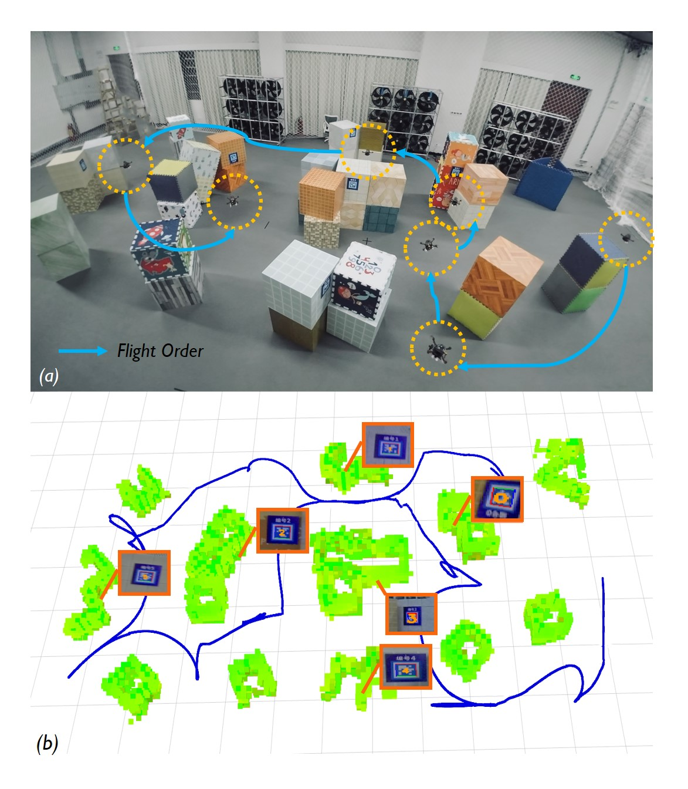

# STAR-Searcher
> [Yiming Luo](https://github.com/ymLuo1214) , Zixuan Zhuang, Neng Pan, Chen Feng, Shaojie Shen, Fei Gao, Hui Cheng and [Boyu Zhou](https://sysu-star.com/).
>
> *IEEE Robotics and Automation Letters* (**RA-L** 2024)

This repository contains the codebase and associated resources for our [paper]([https://arxiv.org/pdf/2402.16348]) titled "**Star-Searcher:** An Efficient Aerial **S**ystem for **Tar**get **Search** in Unknown **E**nvi**r**onments ". This work tackles the challenge of autonomous target search using unmanned aerial vehicles (UAVs) in complex unknown environments.

The project involves novel algorithms for:

- **Visibility-based viewpoint clustering** , allows the real-time generation of the global path at the level of viewpoint clusters and local path at the level of individual viewpoints with fewer detours.
- **History-aware path planning**, which utilizes historical path information to prevent inconsistency in consecutive planning processes.
- Other useful tools for autonomous search tasks.

Video links on [Youtube](https://www.youtube.com/watch?v=08ll_oo_DtU&t=9s) and [Bilibili](https://www.bilibili.com/video/BV1Wy4y1c7vj/?spm_id_from=333.337.search-card.all.click&vd_source=aae82f386a0df1c60f9e0c6925a430e4). Please kindly star ⭐ this project if it helps you. 

## Quick Start

The project has been tested on Ubuntu 20.04(ROS Noetic) and 18.04(ROS Melodic). Take Ubuntu 20.04 as an example, run the following commands to setup:

~~~bash
  sudo apt-get install libnlopt-dev
  cd ${YOUR_WORKSPACE_PATH}/src
  git clone git@github.com:SYSU-STAR/STAR-Searcher.git
  cd ../ 
  catkin_make
~~~

After the compilation you can start the simulation environments by:

~~~bash
source devel/setup.bash && roslaunch exploration_manager env_simulation.launch
~~~

the simulation world filename is also specified in this launch file. After loading the world, run the uav simulation by:

~~~bash
source devel/setup.bash && roslaunch exploration_manager uav_simulation.launch
~~~

Then you can run the simulation and visualization by:

~~~bash
source devel/setup.bash && roslaunch exploration_manager rviz.launch 2> >(grep -v TF_REPEATED_DATA )
source devel/setup.bash && roslaunch exploration_manager search_map1.launch 2> >(grep -v TF_REPEATED_DATA )
~~~

You will find the local map and frontiers in the `rviz` and use the `2D Nav Goal` to send the begin message.

## Known Issues

- If you encounter compilation errors about nlopt, like"No such file nlopt.hpp", please install nlopt manually (refer to this [document](https://nlopt.readthedocs.io/en/latest/NLopt_Installation/)).

## Citation

~~~latex
@article{Luo_2024,
   title={Star-Searcher: A Complete and Efficient Aerial System for Autonomous Target Search in Complex Unknown Environments},
   volume={9},
   ISSN={2377-3774},
   url={http://dx.doi.org/10.1109/LRA.2024.3379840},
   DOI={10.1109/lra.2024.3379840},
   number={5},
   journal={IEEE Robotics and Automation Letters},
   publisher={Institute of Electrical and Electronics Engineers (IEEE)},
   author={Luo, Yiming and Zhuang, Zixuan and Pan, Neng and Feng, Chen and Shen, Shaojie and Gao, Fei and Cheng, Hui and Zhou, Boyu},
   year={2024},
   month=may, pages={4329–4336} }
~~~
